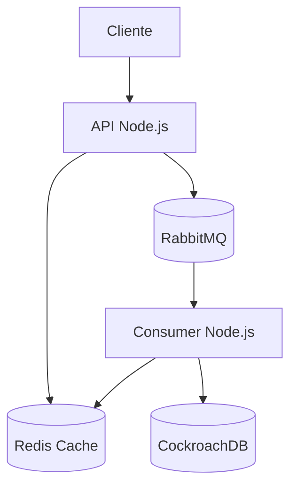

# Arquitetura do Sistema Key-Value Store

## Diagrama de Arquitetura

## Componentes

### 1. API (Node.js)
- Servidor Express.js na porta 3003
- Recebe requisições HTTP
- Gerencia o cache no Redis
- Publica mensagens no RabbitMQ
- Implementa endpoints:
  - PUT /api: Inserir/atualizar chave-valor
  - GET /api/:key: Recuperar valor
  - DELETE /api/:key: Remover chave-valor

### 2. Redis
- Cache em memória
- Armazena pares chave-valor
- Resposta rápida para leituras
- Configurado para persistência

### 3. RabbitMQ
- Message broker
- Gerencia filas de mensagens
- Garante entrega de mensagens
- Filas:
  - add_key: Para operações PUT
  - del_key: Para operações DELETE

### 4. Consumer (Node.js)
- Processa mensagens do RabbitMQ
- Mantém consistência entre Redis e CockroachDB
- Executa operações assíncronas
- Implementa lógica de retry e tratamento de erros

### 5. CockroachDB
- Banco de dados persistente
- Armazena dados permanentemente
- Garante consistência dos dados
- Tabela: key_value (key, value, timestamp)

## Fluxo de Dados

1. **Operação PUT**:
   - Cliente envia requisição para API
   - API atualiza Redis
   - API publica mensagem no RabbitMQ
   - Consumer processa mensagem e atualiza CockroachDB

2. **Operação GET**:
   - Cliente envia requisição para API
   - API consulta Redis
   - Se não encontrar, consulta CockroachDB
   - Retorna valor encontrado ou erro 404

3. **Operação DELETE**:
   - Cliente envia requisição para API
   - API remove do Redis
   - API publica mensagem no RabbitMQ
   - Consumer processa mensagem e remove do CockroachDB

## Características

- **Alta Disponibilidade**: Sistema distribuído com redundância
- **Consistência Eventual**: Sincronização assíncrona entre Redis e CockroachDB
- **Baixa Latência**: Cache em Redis para operações rápidas
- **Persistência**: Dados armazenados permanentemente no CockroachDB
- **Escalabilidade**: Componentes independentes podem ser escalados separadamente

## Monitoramento

- Logs de cada componente via Docker
- Métricas de performance via testes de carga
- Verificação de consistência via scripts de teste 